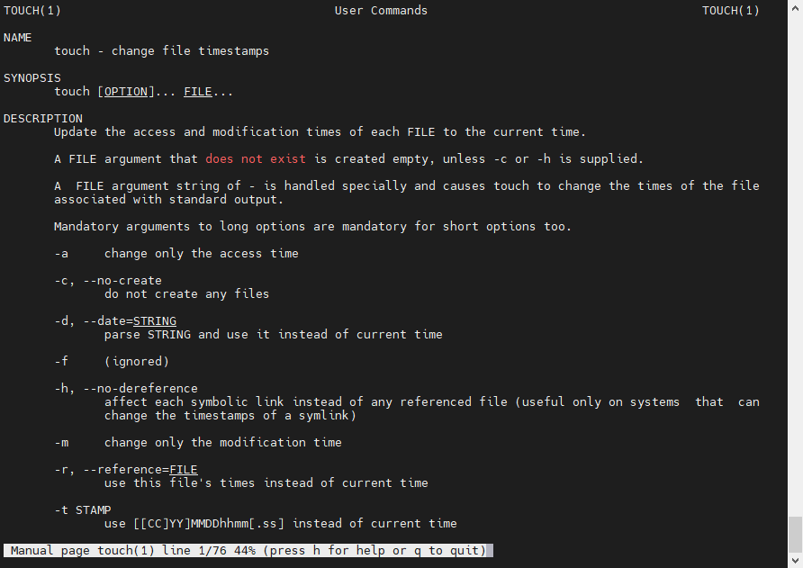
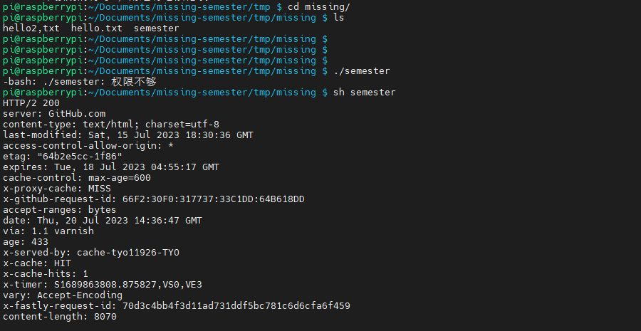
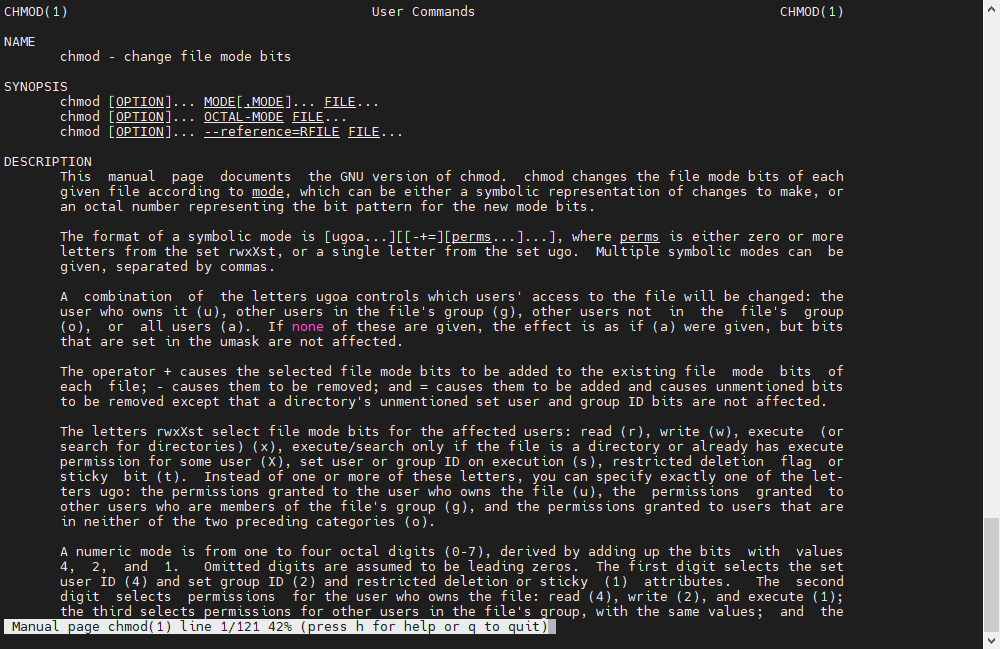
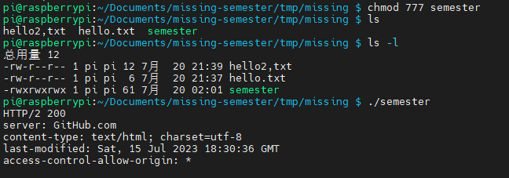

# Motivation

As computer scientists, we know that computers are great at aiding in
repetitive tasks. However, far too often, we forget that this applies
just as much to our _use_ of the computer as it does to the computations
we want our programs to perform. We have a vast range of tools
available at our fingertips that enable us to be more productive and
solve more complex problems when working on any computer-related
problem. Yet many of us utilize only a small fraction of those tools; we
only know enough magical incantations by rote to get by, and blindly
copy-paste commands from the internet when we get stuck.

This class is an attempt to address this.

We want to teach you how to make the most of the tools you know, show
you new tools to add to your toolbox, and hopefully instill in you some
excitement for exploring (and perhaps building) more tools on your own.
This is what we believe to be the missing semester from most Computer
Science curricula.

# Class structure

The class consists of 11 1-hour lectures, each one centering on a
[particular topic](/2020/). The lectures are largely independent,
though as the semester goes on we will presume that you are familiar
with the content from the earlier lectures. We have lecture notes
online, but there will be a lot of content covered in class (e.g. in the
form of demos) that may not be in the notes. We will be recording
lectures and posting the recordings online.

We are trying to cover a lot of ground over the course of just 11 1-hour
lectures, so the lectures are fairly dense. To allow you some time to
get familiar with the content at your own pace, each lecture includes a
set of exercises that guide you through the lecture's key points. After
each lecture, we are hosting office hours where we will be present to
help answer any questions you might have. If you are attending the class
online, you can send us questions at
[missing-semester@mit.edu](mailto:missing-semester@mit.edu).

Due to the limited time we have, we won't be able to cover all the tools
in the same level of detail a full-scale class might. Where possible, we
will try to point you towards resources for digging further into a tool
or topic, but if something particularly strikes your fancy, don't
hesitate to reach out to us and ask for pointers!

# Topic 1: The Shell

## What is the shell?

Computers these days have a variety of interfaces for giving them
commands; fanciful graphical user interfaces, voice interfaces, and
even AR/VR are everywhere. These are great for 80% of use-cases, but
they are often fundamentally restricted in what they allow you to do —
you cannot press a button that isn't there or give a voice command that
hasn't been programmed. **To take full advantage of the tools your**
**computer provides, we have to go old-school and drop down to a textual**
**interface: The Shell.**

Nearly all platforms you can get your hand on has a shell in one form or
another, and many of them have several shells for you to choose from.
While they may vary in the details, at their core they are all roughly
the same: they allow you to run programs, give them input, and inspect
their output in a semi-structured way.

In this lecture, we will focus on the <u>Bourne Again SHell, or "bash"</u> for
short. This is one of the most widely used shells, and its syntax is
similar to what you will see in many other shells. To open a shell
_prompt_ (where you can type commands), you first need a _terminal_.
Your device probably shipped with one installed, or you can install one
fairly easily.

## Using the shell:heavy_check_mark:

When you launch your terminal, you will see a _prompt_ that often looks
a little like this:

```console
missing:~$ 
```

**This is the main textual interface to the shell**. It tells you that you
are on the machine `missing` and that your "current working directory",
or where you currently are, is `~` (short for "home"). The `$` tells you
that you are not the root user (more on that later). At this prompt you
can type a _command_, which will then be interpreted by the shell. The
most basic command is to execute a program:

```console
missing:~$ date
Fri 10 Jan 2020 11:49:31 AM EST
missing:~$ 
```

Here, we executed the `date` program, which (perhaps unsurprisingly)
prints the current date and time. The shell then asks us for another
command to execute. We can also execute a command with _arguments_:

```console
missing:~$ echo hello
hello
```

In this case, we told the shell to execute the program `echo` with the
argument `hello`. The `echo` program simply prints out its arguments.
<font color= red>**The shell parses the command by splitting it by whitespace**</font>, and then
runs the program indicated by the first word, supplying each subsequent
word as an argument that the program can access. If you want to provide
an argument that contains spaces or other special characters (e.g., a
directory named "My Photos"), you can either quote the argument with `'`
or `"` (`"My Photos"`), or escape just the relevant characters with `\`
(`My\ Photos`).

But how does the shell know how to find the `date` or `echo` programs?
Well, the shell is a programming environment, <u>just like Python or Ruby,</u>
and so it has variables, conditionals, loops, and functions (next
lecture!). When you run commands in your shell, you are really writing a
small bit of code that your shell interprets. If the shell is asked to
execute a command that doesn't match one of its programming keywords, it
consults an _environment variable_ called `$PATH` that lists which
directories the shell should search for programs when it is given a
command:


```console
missing:~$ echo $PATH
/usr/local/sbin:/usr/local/bin:/usr/sbin:/usr/bin:/sbin:/bin
missing:~$ which echo
/bin/echo
missing:~$ /bin/echo $PATH
/usr/local/sbin:/usr/local/bin:/usr/sbin:/usr/bin:/sbin:/bin
```

When we run the `echo` command, the shell sees that it should execute
the program `echo`, and then searches through the `:`-separated list of
directories in `$PATH` for a file by that name. When it finds it, it
runs it (assuming the file is _executable_; more on that later). We can
find out which file is executed for a given program name using the
`which` program. We can also bypass `$PATH` entirely by giving the
_path_ to the file we want to execute.

## Navigating in the shell:heavy_check_mark:

A path on the shell is a delimited list of directories; separated by `/`
on Linux and macOS and `\` on Windows. On Linux and macOS, the path `/`
is the "root" of the file system, under which all directories and files
lie, whereas on Windows there is one root for each disk partition (e.g.,
`C:\`). We will generally assume that you are using a Linux filesystem
in this class. A path that starts with `/` is called an _absolute_ path.
Any other path is a _relative_ path. Relative paths are relative to the
current working directory, which we can see with the `pwd` command and
change with the `cd` command. In a path, `.` refers to the current
directory, and `..` to its parent directory:

```console
missing:~$ pwd
/home/missing
missing:~$ cd /home
missing:/home$ pwd
/home
missing:/home$ cd ..
missing:/$ pwd
/
missing:/$ cd ./home
missing:/home$ pwd
/home
missing:/home$ cd missing
missing:~$ pwd
/home/missing
missing:~$ ../../bin/echo hello
hello
```

Notice that our shell prompt kept us informed about what our current
working directory was. You can configure your prompt to show you all
sorts of useful information, which we will cover in a later lecture.

In general, when we run a program, it will operate in the current
directory unless we tell it otherwise. For example, it will usually
search for files there, and create new files there if it needs to.

To see what lives in a given directory, we use the `ls` command:

```console
missing:~$ ls
missing:~$ cd ..
missing:/home$ ls
missing
missing:/home$ cd ..
missing:/$ ls
bin
boot
dev
etc
home
...
```

Unless a directory is given as its first argument, `ls` will print the
contents of the current directory. Most commands accept flags and
options (flags with values) that start with `-` to modify their
behavior. Usually, running a program with the `-h` or `--help` flag
will print some help text that tells you what flags
and options are available. For example, `ls --help` tells us:

```
  -l                         use a long listing format
```

```console
missing:~$ ls -l /home
drwxr-xr-x 1 missing  users  4096 Jun 15  2019 missing
```

This gives us a bunch more information about each file or directory
present. First, the `d` at the beginning of the line tells us that
`missing` is a directory. Then follow three groups of three characters
(`rwx`). These indicate what permissions the owner of the file
(`missing`), the owning group (`users`), and everyone else respectively
have on the relevant item. A `-` indicates that the given principal does
not have the given permission. Above, only the owner is allowed to
modify (`w`) the `missing` directory (i.e., add/remove files in it). To
enter a directory, a user must have "search" (represented by "execute":
`x`) permissions on that directory (and its parents). To list its
contents, a user must have read (`r`) permissions on that directory. For
files, the permissions are as you would expect. Notice that nearly all
the files in `/bin` have the `x` permission set for the last group,
"everyone else", so that anyone can execute those programs.

Some other handy programs to know about at this point are `mv` (to
rename/move a file), `cp` (to copy a file), and `mkdir` (to make a new
directory).

If you ever want _more_ information about a program's arguments, inputs,
outputs, or how it works in general, give the `man` program a try. It
takes as an argument the name of a program, and shows you its _manual
page_. Press `q` to exit.

```console
missing:~$ man ls
```

## Connecting programs:heavy_check_mark:

In the shell, programs have two primary "streams" associated with them:
their input stream and their output stream. When the program tries to
read input, it reads from the input stream, and when it prints
something, it prints to its output stream. Normally, a program's input
and output are both your terminal. That is, your keyboard as input and
your screen as output. However, we can also rewire those streams!

<font color = Red>**The simplest form of redirection is `< file` and `> file`.**</font> These let you
rewire the input and output streams of a program to a file respectively:

```console
missing:~$ echo hello > hello.txt
missing:~$ cat hello.txt
hello
missing:~$ cat < hello.txt
hello
missing:~$ cat < hello.txt > hello2.txt
missing:~$ cat hello2.txt
hello
```

Demonstrated in the example above, `cat` is a program that con`cat`enates
files. When given file names as arguments, it prints the contents of each of
the files in sequence to its output stream. But when `cat` is not given any
arguments, it prints contents from its input stream to its output stream (like
in the third example above).

You can also use `>>` to append to a file. 

> `>`会覆盖，而 `>>` 不会

Where this kind of
input/output redirection really shines is in the use of _**pipes**_. The `|`
operator lets you "chain" programs such that the output of one is the
input of another:

```console
missing:~$ ls -l / | tail -n1
drwxr-xr-x 1 root  root  4096 Jun 20  2019 var
missing:~$ curl --head --silent google.com | grep --ignore-case content-length | cut --delimiter=' ' -f2
219
```

We will go into a lot more detail about how to take advantage of pipes
in the lecture on data wrangling.

## A versatile and powerful tool:heavy_check_mark:

On most Unix-like systems, one user is special: the "root" user. You may
have seen it in the file listings above. The root user is above (almost)
all access restrictions, and can create, read, update, and delete any
file in the system. You will not usually log into your system as the
root user though, since it's too easy to accidentally break something.
Instead, you will be using the `sudo` command. As its name implies, it
lets you "do" something "as su" (short for "super user", or "root").
When you get permission denied errors, it is usually because you need to
do something as root. Though make sure you first double-check that you
really wanted to do it that way!

One thing you need to be root in order to do is writing to the `sysfs` file
system mounted under `/sys`. `sysfs` exposes a number of kernel parameters as
files, so that you can easily reconfigure the kernel on the fly without
specialized tools. **Note that sysfs does not exist on Windows or macOS.**

For example, the brightness of your laptop's screen is exposed through a file
called `brightness` under

```
/sys/class/backlight
```

By writing a value into that file, we can change the screen brightness.
Your first instinct might be to do something like:

```console
$ sudo find -L /sys/class/backlight -maxdepth 2 -name '*brightness*'
/sys/class/backlight/thinkpad_screen/brightness
$ cd /sys/class/backlight/thinkpad_screen
$ sudo echo 3 > brightness
An error occurred while redirecting file 'brightness'
open: Permission denied
```

This error may come as a surprise. After all, we ran the command with
`sudo`! This is an important thing to know about the shell. Operations
like `|`, `>`, and `<` are done _by the shell_, not by the individual
program. `echo` and friends do not "know" about `|`. They just read from
their input and write to their output, whatever it may be. In the case
above, the _shell_ (which is authenticated just as your user) tries to
open the brightness file for writing, before setting that as `sudo
echo`'s output, but is prevented from doing so since the shell does not
run as root. Using this knowledge, we can work around this:

```console
$ echo 3 | sudo tee brightness
```

Since the `tee` program is the one to open the `/sys` file for writing,
and _it_ is running as `root`, the permissions all work out. You can
control all sorts of fun and useful things through `/sys`, such as the
state of various system LEDs (your path might be different):

```console
$ echo 1 | sudo tee /sys/class/leds/input6::scrolllock/brightness
```

# Next steps

At this point you know your way around a shell enough to accomplish
basic tasks. You should be able to navigate around to find files of
interest and use the basic functionality of most programs. In the next
lecture, we will talk about how to perform and automate more complex
tasks using the shell and the many handy command-line programs out
there.

# Exercises

All classes in this course are accompanied by a series of exercises. Some give
you a specific task to do, while others are open-ended, like "try using X and Y
programs". We highly encourage you to try them out.

We have not written solutions for the exercises. If you are stuck on anything
in particular, feel free to send us an email describing what you've tried so
far, and we will try to help you out.

 - [x] For this course, you need to be using a Unix shell like Bash or ZSH. If you
    are on Linux or macOS, you don't have to do anything special. If you are on
    Windows, you need to make sure you are not running cmd.exe or PowerShell;
    you can use [Windows Subsystem for
    Linux](https://docs.microsoft.com/en-us/windows/wsl/) or a Linux virtual
    machine to use Unix-style command-line tools. To make sure you're running
    an appropriate shell, you can try the command `echo $SHELL`. If it says
    something like `/bin/bash` or `/usr/bin/zsh`, that means you're running the
    right program.
 - [x] Create a new directory called `missing` under `/tmp`.
 - [x] Look up the `touch` program. The `man` program is your friend.

    
 - [x] Use `touch` to create a new file called `semester` in `missing`.
 - [x] Write the following into that file, one line at a time:
    ```
    #!/bin/sh
    curl --head --silent https://missing.csail.mit.edu
    ```
    The first line might be tricky to get working. It's helpful to know that
    `#` starts a comment in Bash, **and `!` has a special meaning even within**
    **double-quoted (`"`) strings**. Bash treats single-quoted strings (`'`)
    differently: they will do the trick in this case. See the Bash
    [quoting](https://www.gnu.org/software/bash/manual/html_node/Quoting.html)
    manual page for more information.

    > **here it seems like i sould try 'Connecting programs' but not 'vim'**
    >
    > ok
    >
    > ```bash
    > echo '#!/bin/sh' > semester
    > 
    > echo 'curl --head --silent https://missing.csail.mit.edu' >> semester
    > ```
    >
    > 
 - [x] Try to execute the file, i.e. type the path to the script (`./semester`)
    into your shell and press enter. Understand why it doesn't work by
    consulting the output of `ls` (hint: look at the permission bits of the
    file).(:question:)
    
    
 - [ ] Run the command by explicitly starting the `sh` interpreter, and giving it
    the file `semester` as the first argument, i.e. `sh semester`. Why does
    this work, while `./semester` didn't?
    
    > 直接运行打不开`./semester`说没有权限，但是`sh semester`就可以
    >
    > 
    >
    > 
    >
    > **chatgptA:**
    >
    > ***
    >
    > "sh semester" 能够运行，而"./semester"不能运行的原因与操作系统如何处理脚本文件中的shebang（`#!`）行有关。
    >
    > 在你的 "semester" 脚本中，你在顶部有一个shebang行 `#!/bin/sh`，它指示脚本应该使用 `/bin/sh` shell 来解释执行。当你运行 "sh semester" 时，你明确告诉操作系统使用 "sh" 解释器来执行该脚本。这样运行是有效的，因为在使用特定解释器显式执行脚本时，shebang行会被忽略。
    >
    > 另一方面，当你尝试运行 "./semester" 时，shebang行并不会被忽略。相反，操作系统会查看shebang行，以确定应该使用哪个解释器来执行脚本。在这种情况下，shebang行 `#!/bin/sh` 指定了脚本应该使用 `/bin/sh` shell 来执行。然而，可能存在shebang行或"sh"解释器路径的问题，这可能导致脚本无法按预期运行。
    >
    > 如果"./semester"不能运行，你可以检查以下几点：
    >
    > 1. 检查shebang行：确保 "semester" 脚本中的shebang行是正确的，并且指向了 "sh" 解释器的有效路径。它应该像这样：
    >
    >    ```bash
    >    #!/bin/sh
    >    ```
    >
    > 2. <font color = Red>**检查文件权限：**</font>确保 "semester" 脚本具有执行权限。你可以使用以下命令设置执行权限：
    >
    >    ```bash
    >    chmod +x semester
    >    ```
    >
    > 3. 验证 "sh" 解释器：检查你的系统上是否安装了 "sh" 解释器，并且该解释器在指定的路径 `/bin/sh` 可用。你可以通过运行以下命令验证：
    >
    >    ```bash
    >    which sh
    >    ```
    >
    >    这将返回 "sh" 解释器的路径。
    >
    > 4. 检查工作目录：当你运行 "./semester" 时，请确保你在与 "semester" 脚本位于同一目录中。如果脚本在不同的目录中，你需要提供正确的脚本路径。
    >
    > 通过明确运行 "sh semester"，你绕过了shebang行，并直接指定了解释器，因此在这种情况下它能够运行。但是，如果你希望将脚本作为可执行文件运行（即 "./semester"），你需要确保shebang行和文件权限设置正确，并且 "sh" 解释器在指定的路径上可用。
    >
    > ***
    >
    > because didn't have excute permissions!!
    
    
 - [x] Look up the `chmod` program (e.g. use `man chmod`).

    

    :sweat:说实话没完全看懂
 - [x] Use `chmod` to make it possible to run the command `./semester` rather than
    having to type `sh semester`. How does your shell know that the file is
    supposed to be interpreted using `sh`? See this page on the
    [shebang](https://en.wikipedia.org/wiki/Shebang_(Unix)) line for more
    information.
    
    
 - [x] Use `|` and `>` to write the "last modified" date output by
    `semester` into a file called `last-modified.txt` in your home
    directory.
    
    ```bash
    ./semester | grep last-modified > ../../last-modified.txt
    ```
    
    > **chatgptA：**
    >
    > `grep` 是 Linux 和 Unix 系统中一个强大的文本搜索工具，用于在文件中查找特定的模式（字符串）。`grep` 命令的基本语法如下：
    >
    > ```
    > grep [options] pattern [file ...]
    > ```
    >
    > 其中：
    >
    > - `options`：可选参数，用于控制 `grep` 命令的行为。例如，`-i` 表示忽略大小写，`-n` 表示显示匹配行的行号等。您可以使用 `grep --help` 命令查看所有可用选项的详细信息。
    >
    > - `pattern`：要搜索的模式或字符串。
    >
    > - `file ...`：可选参数，指定要在哪些文件中搜索模式。如果不指定文件名，则 `grep` 命令将从标准输入读取数据（通常是通过管道传递数据给 `grep`）。
    >
    > 下面是一些常用的 `grep` 命令示例：
    >
    > 1. 在文件中搜索指定字符串：
    >
    > ```bash
    > grep "search_string" file.txt
    > ```
    >
    > 2. 忽略大小写搜索：
    >
    > ```bash
    > grep -i "search_string" file.txt
    > ```
    >
    > 3. 显示匹配行的行号：
    >
    > ```bash
    > grep -n "search_string" file.txt
    > ```
    >
    > 4. 递归搜索目录中的文件：
    >
    > ```bash
    > grep "search_string" -r directory/
    > ```
    >
    > 5. 使用正则表达式进行搜索：
    >
    > ```bash
    > grep -E "pattern" file.txt
    > ```
    >
    > 6. 只显示匹配的字符串本身（不显示整行）：
    >
    > ```bash
    > grep -o "pattern" file.txt
    > ```
    >
    > 7. 反向搜索（显示不匹配的行）：
    >
    > ```bash
    > grep -v "pattern" file.txt
    > ```
    >
    > 8. 统计匹配到的行数：
    >
    > ```bash
    > grep -c "search_string" file.txt
    > ```
    >
    > 请注意，`grep` 命令区分大小写。如果您需要进行大小写不敏感的搜索，可以使用 `-i` 选项。另外，<font color = red>**`grep` 默认会输出包含匹配字符串的整行内容**</font>。如果您只希望输出匹配的字符串本身，可以使用 `-o` 选项。
 - [ ] Write a command that reads out your laptop battery's power level or your
    desktop machine's CPU temperature from `/sys`. Note: if you're a macOS
    user, your OS doesn't have sysfs, so you can skip this exercise.
    
    > 没有这个目录
