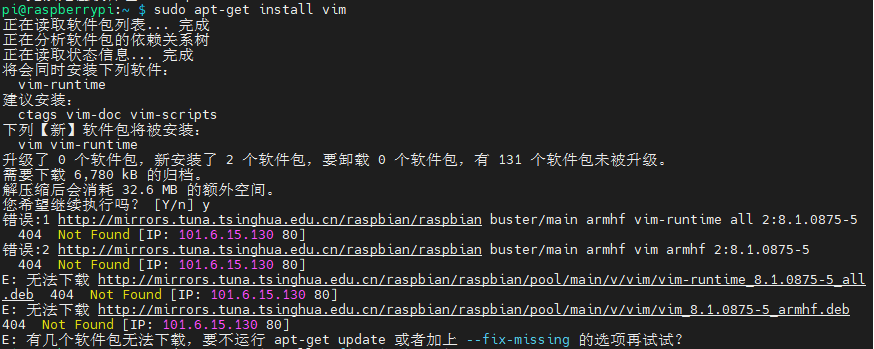
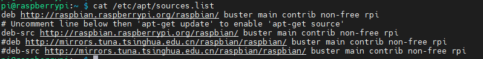
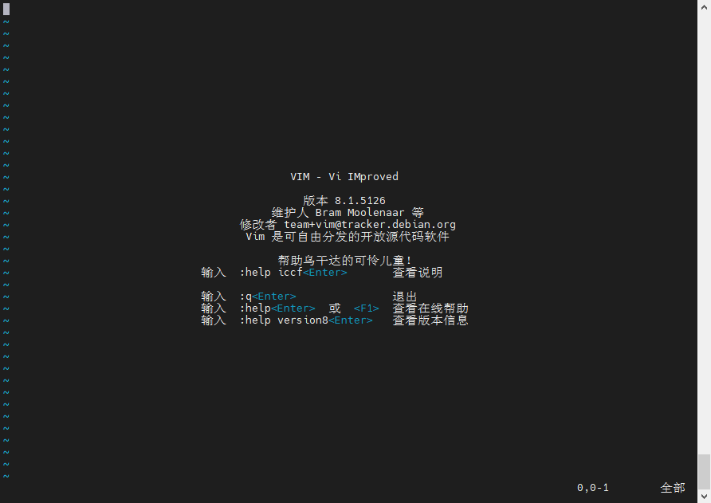

### **my linux operation system**

Linux based on raspberry 3B

### connection type

SSH

> [新手教程：如何 SSH 进入树莓派](https://zhuanlan.zhihu.com/p/66735155)
>
> ip:192.168.1.11

VNC

> ```bash
> sudo raspi-config
> ```
>
> [树莓派 VNC Viewer 远程桌面配置教程](https://shumeipai.nxez.com/2018/08/31/raspberry-pi-vnc-viewer-configuration-tutorial.html)

### install

VIM

> 现象：
>
> 不知道为啥清华的那个镜像源一直报错有两个文件无法下载（确实我的电脑也点不开链接）
>
> 
>
> 解决方案：
>
> 将清华的软件源（最下面两行）替换成了原本的，如下图所示
>
> 
>
> > *注意Linux版本：buster*
>
> 替换完成后保存退出>`sudo apt update`>`sudo apt install vim`
>
> 下载成功！vim版本信息
>
> 

#### **Q&A**

连接不上wifi

> [树莓派4B出现no wireless interfaces are found](https://blog.csdn.net/m0_52360909/article/details/125131902)
>
> 写入了wifi密码之后重启，然后用了图形界面设置了wifi

树莓派有黑边

> [树莓派显示有黑边，或许是因为你没有这样设置？](https://blog.csdn.net/qq_33475105/article/details/113487870)

为什么安装的时候报错无法下载

> chatgpt：
>
> 我无法直接检查特定URL的可用性，因为我无法浏览互联网或访问特定的网站。但是，如果您无法下载特定的deb文件，可能有几个原因导致这种情况：
>
> 1. **网络连接问题：** 首先，请确保您的树莓派能够访问互联网，并且网络连接正常。尝试使用其他网站或工具来验证网络连接是否正常。
>
> 2. **镜像服务器问题：** 如果您指定的镜像服务器（如清华大学的镜像服务器）当前不可用，您可能无法下载文件。镜像服务器可能因维护、更新或其他问题而暂时关闭。
>
> 3. **文件路径错误：** 确保您提供的文件URL路径是正确的。检查拼写错误、斜杠方向和其他细节。
>
> 4. **权限问题：** 如果您没有足够的权限来下载该文件，可能会受到限制。尝试在命令前添加`sudo`来以超级用户权限运行下载命令。
>
> 5. **软件包不存在：** 最后，确保您尝试下载的软件包实际上存在于指定的镜像服务器上。如果软件包已被移除或重命名，您将无法通过特定URL下载它。
>
> 如果您确定网络连接和权限没有问题，但仍无法下载该文件，您可以尝试使用其他镜像服务器，或者使用默认的Raspberry Pi官方镜像源。可以尝试使用以下命令来更新软件包列表并安装Vim：
>
> ```bash
> sudo apt update
> sudo apt install vim
> ```
>
> 这将从默认的Raspberry Pi软件源中获取并安装Vim编辑器。
